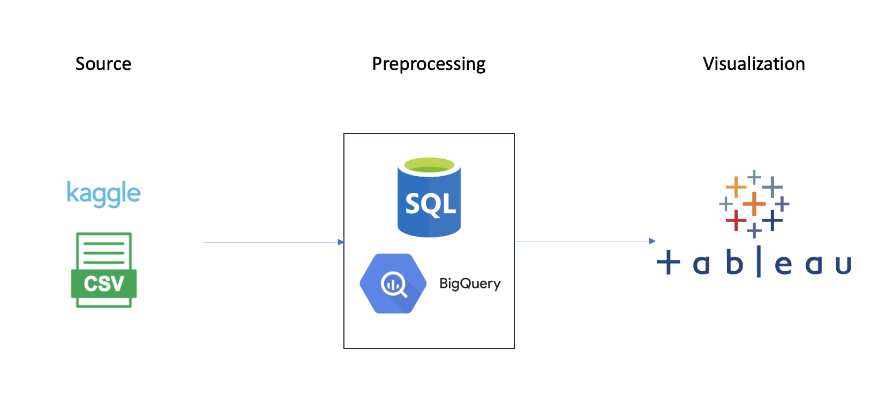
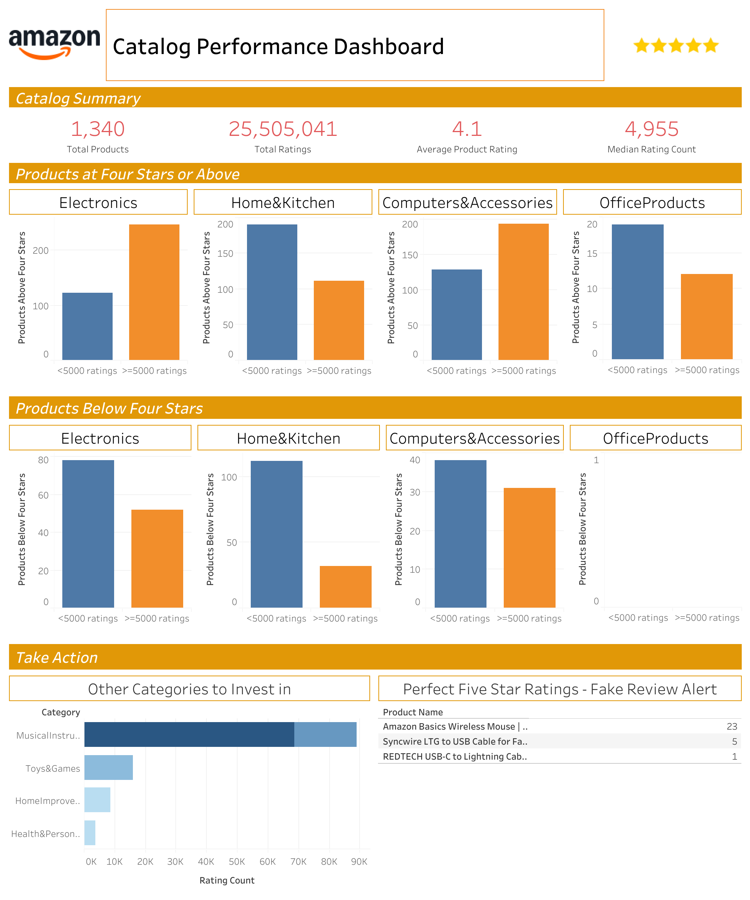

# :deciduous_tree:Amazon Catalog Analysis

## Objective
This project analyzes customer feedback to Amazon products to understand how the company can maximize its catalog quality.

## Data Pipeline

1. The dataset is extracted from [Kaggle](https://www.kaggle.com/datasets/karkavelrajaj/amazon-sales-dataset) and saved locally.
2. Missing values, improper formatting and duplicate entries are cleaned out with SQL in BigQuery.
3. The cleaned data is exported as a .csv table and fed to Tableau as a data source.
4. Data is processed into various KPIs, graphs and tables for [visualization](https://public.tableau.com/app/profile/zhongkuan.lin/viz/AmazonCatalogPerformance/AmazonProductRatingsDashboard).

## Insights
1. Catalog is performing well, with a high average rating of 4.1 stars across 1,340 different products.
2. The catalog is dominated by products in the category of Electronics, Home Kitchen, and Computer Accessories. Most other categories only have 1 or 2 products, though some, such as Musical Instruments, have gained popularity.
3. Product rating count is very positively skewed. The median rating count is roughly 5000, but the upper half of products go into the tens of thousands, with the most popular hitting over 420,000 ratings.
4. No clear correlation between popularity and rating. Some products with less than 5,000 ratings have a score of four or more, whiile several popular products have below average ratings.

## Recommendations
1. Highlight our strongest categories. New customers should have immediate access to the massive selection of popular items in the categories of Electronics, Home Kitchen and Computer Accessories. 
    - If expanding into new categories, consider Musical Instruments, as both items in the current category have tens of thousands of ratings, many times the median count.
2. Increase search visibility of products with less than 5,000 ratings but scores of more than four stars. Decrease search visibility of products with more than 5,000 ratings but scores of less than four stars. This ensures customers are always exposed to the best of the catalog, facilitating sales.
3. Investigate products with perfect 5 star ratings. If coming from multiple reviewers, perfect 5 star ratings are likely cases of review fraud.

## Visualization
Created a [1-page Tableau dashboard](https://public.tableau.com/app/profile/zhongkuan.lin/viz/AmazonCatalogPerformance/AmazonProductRatingsDashboard) to visualize the data.

